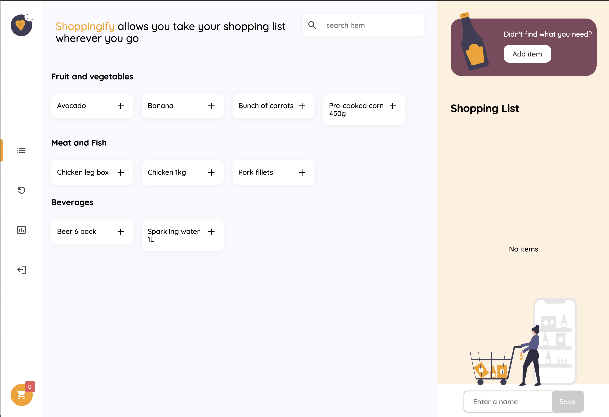
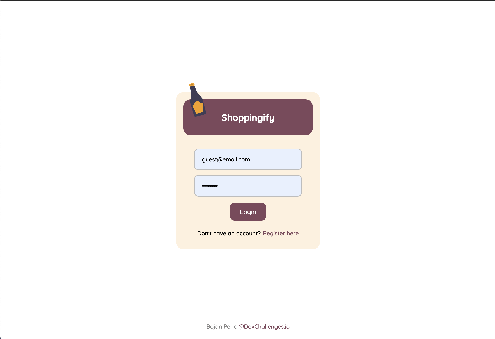
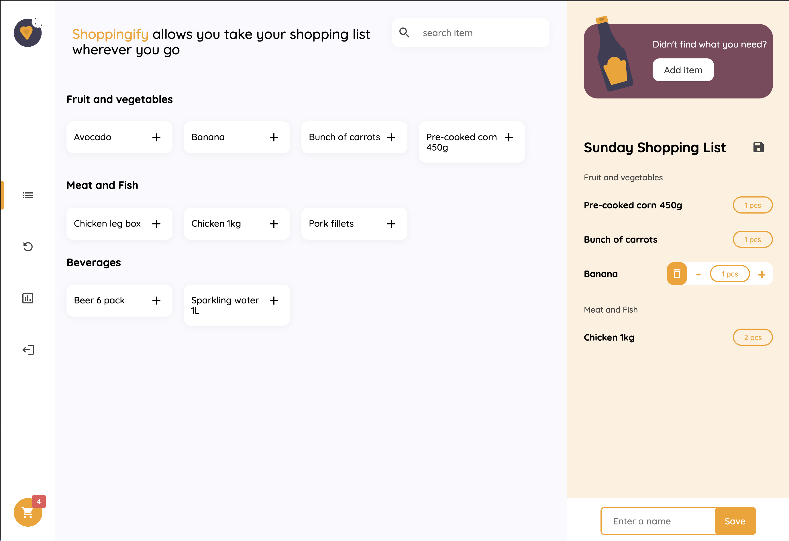
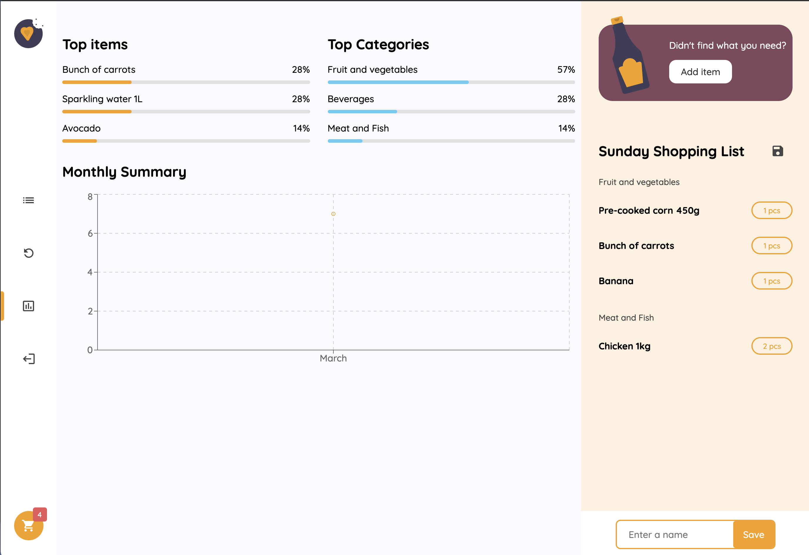

# My Recipe App

This is a personal project which I build using the MERN stack.

  <h3>
    <a href="https://shoppingify-client.netlify.app/">
      Demo
    </a>
  </h3>

   Check backend at: <a href="https://github.com/Boki87/devchallenges-shoppingify-api" target="_blank">https://github.com/Boki87/devchallenges-shoppingify-api</a>.

## Screenshots

### Landing page

### Login modal

### Shopping List

### Shopping List Statistics

## User Stories:

User story: When I select the items tab, I can see a list of items under different categories.
User story: I can add a new item with name, category, note, and image.
User story: When I add a new item, I can select one from the existing categories or add a new one if the category does not exist
User story: When I select an item, I can see its details and I can choose to add the current list or delete the item.
User story: I can add items to the current list
User story: I can increase the number of item in the list
User story: I can remove the item from the list
User story: I can save/update the list with a name (user can have only one active list at a time)
User story: I can toggle between editing state and completing state
User story: When I am at completing state, I can save my progress by selecting the item
User story: I can cancel the active list
User story: When I try to cancel a list, I can see a confirmation notification
User story: I can see my shopping history and I can see the details of it
User story: I can see some statistics: top items, top categories, and monthly comparison
User story: I can search for items

## Main packages used:

1. React
2. React Router Dom
3. React Toastify
4. React Redux Toolkit
5. Axios
6. Recharts
